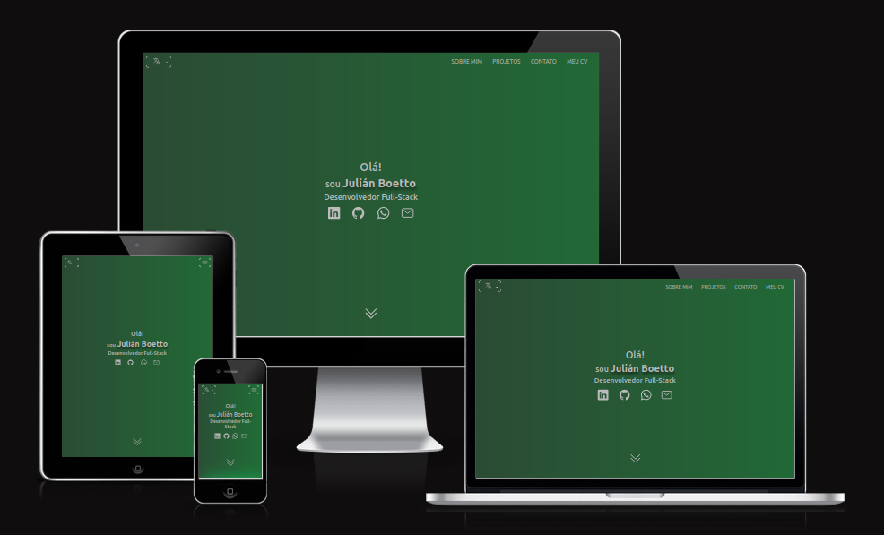

<h2 align="center">
  Portfolio - v2.0 
  <a href="https://julianboetto.lat/" target="_blank">Julián Boetto</a> 
</h2>
<h5 align='center'>- english version -</h5>
<h6 align="center">
  <a href="./lang/es/README.md">Español</a> |
  <a href="./lang/pt/README.md">Português</a>
</h6>

  

## Built With

This project was built using these technologies.

- CSS3
- HTML5
- Javascript
- Ion-icons

Without frameworks.

## Features

**📖 One Page Layout**

**🇦🇷 🇧🇷 🇺🇸 multi-language website**

**🎨 Styled with Bootstrap v5.3 and Css**

**📱 Fully Responsive**

<h6 align="center">
  2023 | Julián Boetto
</h6>
